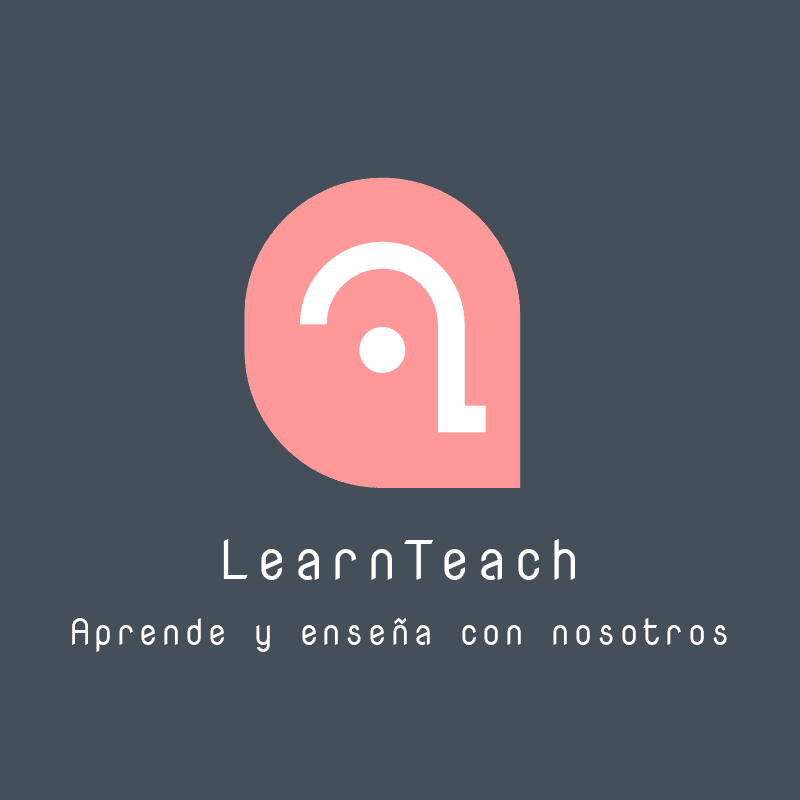
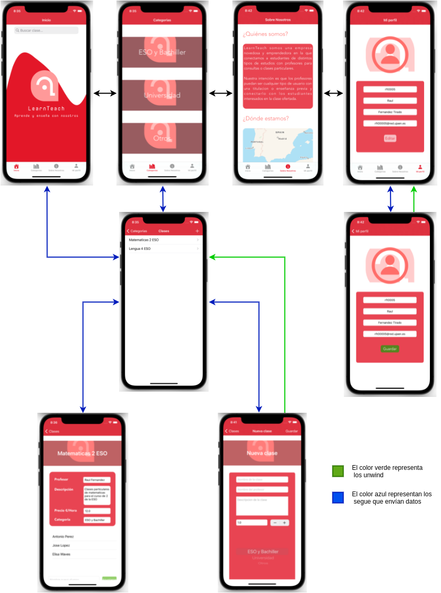
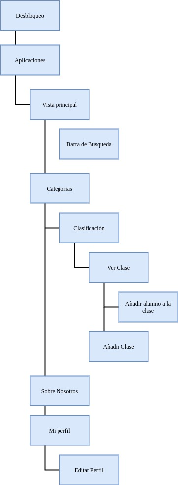
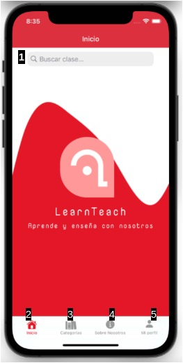
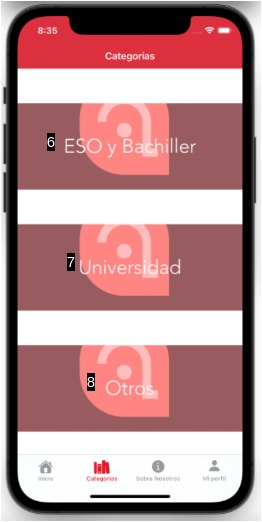
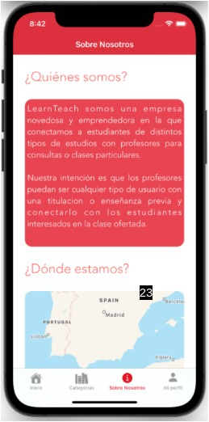

# LearnTeach

### Descripción del proyecto

LearnTeach es una aplicación para publicar clases particulares y apuntarte a ellas, de forma
que cualquier persona puede subir sus clases y promocionarse para que otros se apunten, y de
la misma forma que a la vez que puedas dar clases puedas apuntarte a otras.

### Caminos de la App
➔ Vista inicial. En esta vista es muy sencilla y tiene una barra de búsqueda para poder buscar una clase según lo que busques.

➔ Categorías. Aquí puedes ver las distintas clases que existen mediante una filtración por categorías. A partir de esta luego puedes ver listados de clases y acceder a ellas para ver sus detalles y poder apuntarte. También da acceso a la creación de nuevas clases.

➔ Sobre Nosotros. Esta es una vista informativa en la que se presenta la empresa LearnTeach y su situación.

➔ Mi perfil. Datos básicos del perfil que pueden editarse, a excepción del nombre de usuario

### Storyboard

### Mapa de vistas

### Screenshots

---

---

---

---
